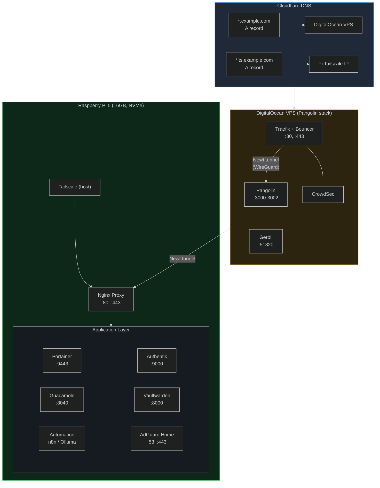

# Homelab

Documentation of my homelab running across a Raspberry Pi 5 and a DigitalOcean VPS (Pangolin stack), connected via Tailscale mesh. Services are managed with Docker Compose, DNS is handled by Cloudflare, and a MikroTik hEX S router enforces network segmentation.

Each service lives in its own directory with a standalone `docker-compose.yml` and a `.env` file. See `.env.example` for all variables with generation instructions.

## Architecture



## Services

| Service | Image | Port | Purpose |
|---------|-------|------|---------|
| **nginx** | jc21/nginx-proxy-manager | host | Reverse proxy + Let's Encrypt SSL |
| **goaccess** | justsky/goaccess-for-nginxproxymanager | 7880 | Web traffic analytics dashboard |
| **authentik** | ghcr.io/goauthentik/server | 9000, 9443 | Identity provider (SSO, MFA, OIDC) |
| **adguardhome** | adguard/adguardhome | 53, 4433 | Network-wide DNS ad blocking |
| **vaultwarden** | vaultwarden/server | 8000 | Password manager (Bitwarden compatible) |
| **tailscale** | tailscale/tailscale | host | Zero-trust VPN node |
| **guacamole** | guacamole/guacamole + postgres:alpine | 8040 | Remote desktop gateway (VNC/RDP/SSH) |
| **loggifly** | loggifly/loggifly | — | Container log monitor → NTFY alerts |
| **n8n** | n8nio/n8n | 5678 | Workflow automation |
| **ollama** | ollama/ollama | 11434 | Local LLM inference |
| **open-webui** | ghcr.io/open-webui/open-webui | 3020 | Web UI for Ollama |
| **pangolin** | fosrl/pangolin + crowdsecurity/crowdsec | 3000, 8080 | Security dashboard + IDS (VPS) |
| **wazuh** | wazuh/wazuh-manager + wazuh-agent | 1514, 1515, 55000 | XDR/SIEM — endpoint monitoring, FIM |
| **nessus** | tenable/nessus:latest-oracle | 8834 | Vulnerability scanner |

### Identity and Access Management

#### Authentik

Open-source Identity Provider with SSO, MFA, and OIDC. Supports OpenID Connect for SSO integration with other services (Guacamole, Vaultwarden).
[→ Details](pi/docker/authentik/)

### Remote Access Services

#### Apache Guacamole

Clientless remote desktop gateway (VNC/RDP/SSH) via HTML5 with Authentik SSO support.
[→ Details](pi/docker/guacamole/)

### Web Traffic Analytics

#### GoAccess

Real-time analytics dashboard for Nginx Proxy Manager access logs.
[→ Details](pi/docker/nginx/)

### Security Stack

#### Wazuh (SIEM + XDR)

XDR/SIEM with FIM, CIS compliance, and n8n-powered SOAR alert triage.
[→ Details](wazuh/)

#### Tenable Nessus

Self-hosted vulnerability scanner detecting flaws, misconfigurations, and insecure protocols.
[→ Details](https://mluchetti.com/docs/security/nessus/)

### Automation Stack

#### n8n + Ollama + Open WebUI

Workflow automation, local LLM inference (Pi-optimized), and chat UI with RAG.
[→ Details](pi/docker/automation/)

#### NTFY + LoggiFly

Push notification server for alert delivery, with container log monitoring.
[→ Details](pi/docker/automation/)

### VPS Stack

#### Pangolin

DigitalOcean VPS stack with CrowdSec IDS, Traefik reverse proxy, and Pangolin security dashboard.
[→ Details](https://mluchetti.com/docs/pangolin/)

## Networking

### DNS (Cloudflare)

Two wildcard DNS records route traffic:
- `*.example.com` → DigitalOcean VPS public IP (public-facing services via Pangolin)
- `*.ts.example.com` → Pi's Tailscale IP (private services over Tailscale mesh)

### Tailscale Mesh

Tailscale runs in host network mode on the Pi, providing zero-trust mesh VPN. The VPS connects via a Newt (Pangolin's WireGuard agent) tunnel.

Tailnet nodes are organized into tags:

| Tag | Host |
|-----|------|
| `tag:clients` | Workstations / mobile devices |
| `tag:pi` | Raspberry Pi 5 (homelab) |
| `tag:servers` | DigitalOcean VPS (Pangolin stack) |

ACL rules are defined in [`tailscale/acl.json`](tailscale/acl.json). Key policies:

- **DNS** — clients → Pi (tcp/udp:53)
- **HTTP/HTTPS** — clients → servers (tcp:80, 443)
- **SSH** — clients → Pi (tcp:22)
- **Wazuh** — clients → Pi (tcp:1514, 1515, 55000)
- **Subnet route** — clients → 10.0.30.0/24 (all ports)
- **Exit node** — clients → internet (all traffic)

### Network Segmentation (MikroTik)

The Pi is isolated in its own VLAN (VLAN 20, DMZ) on the MikroTik hEX S router. Firewall rules enforce LAN↔Pi SSH/DNS only, block WAN→Pi DNS, and block all other cross-VLAN traffic.

## Prerequisites

- Raspberry Pi 5 (16GB, NVMe) or similar Linux host
- DigitalOcean droplet (for Pangolin stack)
- Tailscale account
- Docker
- Domain names managed in Cloudflare
- Cloudflare DNS API token (for Let's Encrypt)

## Setup

1. Clone this repository:
   ```bash
   git clone <repo-url>
   cd homelab
   ```

2. Review `.env.example` for all available variables, then edit the `.env` file in each service directory:
   ```bash
   cd pi/docker/vaultwarden
   nano .env
   ```

3. Start a service:
   ```bash
   docker compose up -d
   ```

## Hardware

- **Raspberry Pi 5** — 16GB RAM, NVMe storage
- **DigitalOcean Droplet** — Basic Premium Intel (1 vCPU, 1 GB RAM, 35 GB SSD, 1 TB transfer)
- **MikroTik hEX S** router (RouterOS, VLAN segmentation)

## License

This is documentation of my personal setup — feel free to use the compose files as a reference.
