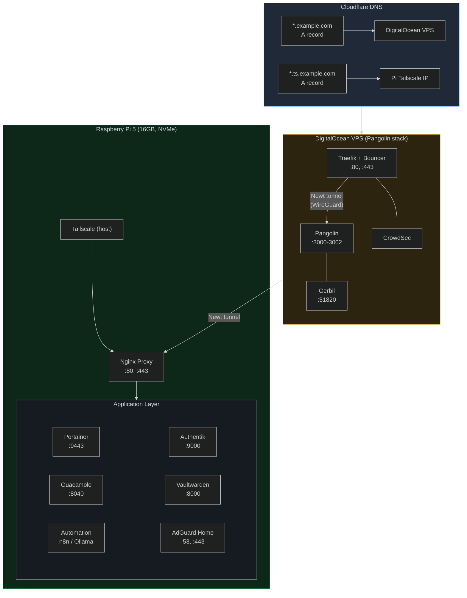

# Homelab

Documentation of my homelab running across a Raspberry Pi 5 and a DigitalOcean VPS (Pangolin stack), connected via Tailscale mesh. Services are managed with Docker Compose, DNS is handled by Cloudflare, and a MikroTik hEX S router enforces network segmentation.

Each service lives in its own directory with a standalone `docker-compose.yml` and a `.env` file. See `.env.example` for all variables with generation instructions.

## Architecture



## Services

| Service | Image | Port | Purpose |
|---------|-------|------|---------|
| **nginx** | jc21/nginx-proxy-manager | host | Reverse proxy + Let's Encrypt SSL |
| **goaccess** | justsky/goaccess-for-nginxproxymanager | 7880 | Web traffic analytics — real-time access logs, visitor stats, and metrics dashboard |
| **authentik** | ghcr.io/goauthentik/server | 9000, 9443 | Identity and access management (IAM) |
| **adguardhome** | adguard/adguardhome | 53, 4433 | Network-wide DNS ad blocking |
| **vaultwarden** | vaultwarden/server | 8000 | Password manager (Bitwarden compatible) |
| **tailscale** | tailscale/tailscale | host | Zero-trust VPN node (host networking) |
| **guacamole** | guacamole/guacamole + postgres:alpine | 8040 | Remote desktop gateway (VNC/RDP/SSH) |
| **loggifly** | loggifly/loggifly | — | Container log monitor → NTFY alerts |
| **n8n** | n8nio/n8n | 5678 | Workflow automation |
| **ollama** | ollama/ollama | 11434 | Local LLM inference |
| **open-webui** | ghcr.io/open-webui/open-webui | 3020 | Web UI for Ollama |
| **pangolin** | fosrl/pangolin + crowdsecurity/crowdsec | 3000, 8080 | Security dashboard + IDS (DigitalOcean droplet) |
| **wazuh** | wazuh/wazuh-manager + wazuh-agent | 1514, 1515, 55000 | XDR/SIEM — endpoint monitoring, file integrity, threat detection |
| **nessus** | tenable/nessus:latest-oracle | 8834 | Vulnerability scanner — detects flaws, misconfigurations, and insecure protocols |

### Identity and Access Management

#### Authentik

Open-source Identity Provider with reverse proxy, SSO, and MFA. Runs three containers:
- **postgresql** — user/application data store
- **server** — web application and API
- **worker** — background tasks and outposts management

Configured with `COMPOSE_PORT_HTTP=9000` and `COMPOSE_PORT_HTTPS=9443`. Supports OpenID Connect for SSO integration with other services in this stack (e.g., Guacamole, Vaultwarden).

### Remote Access Services

#### Apache Guacamole

Clientless remote desktop gateway supporting VNC, RDP, and SSH via HTML5. Runs three containers:
- **guacd** — protocol proxy
- **postgres** — user/connection metadata store
- **guacamole** — web application (served behind a reverse proxy)

- Supports OpenID Connect SSO via Authentik (configure in `pi/docker/guacamole/.env`). Self-signed TLS certs are not included; provide your own or use the reverse proxy.

### Web Traffic Analytics

#### GoAccess

Real-time web traffic analytics for Nginx Proxy Manager. Parses access logs to produce a live dashboard showing:
- Visitor count, bandwidth, and request rates
- Top requested URLs, referrers, and search engine keywords
- Operating system, browser, and device breakdown
- HTTP status codes and response times

Serves an interactive HTML dashboard on port 7880 (`http://<pi-ip>:7880`).

### Security Stack

#### Wazuh (SIEM + XDR)

Open-source security platform providing XDR and SIEM protection for endpoints and cloud workloads. Runs on the Pi with agents deployed to the VPS and other endpoints over Tailscale.

- **File Integrity Monitoring (FIM)** — real-time filesystem change detection with configurable ignore paths and VirusTotal hash integration
- **CIS Benchmarks** — automated compliance scanning for Windows and Linux endpoints
- **SOAR automation** — n8n workflow routes high-severity alerts to a self-hosted Ollama LLM for AI-powered triage, or triggers VirusTotal malware investigation with ntfy/Gmail notifications

Configs are in [`wazuh/`](wazuh/). Detailed walkthroughs at [mluchetti.com/docs/security/wazuh](https://mluchetti.com/docs/security/wazuh/).

#### Tenable Nessus

Self-hosted vulnerability scanner running on the Pi. Detects software flaws, missing patches, misconfigurations, default credentials, and insecure protocols across networked devices.

- **Nessus Essentials** — free license supporting up to 16 IP addresses per scanner
- **Comprehensive scanning** — hosts, web apps, cloud environments, and containerized services
- **Remediation tracking** — generates severity-ranked vulnerability reports with actionable fix guidance

Docs at [mluchetti.com/docs/security/nessus](https://mluchetti.com/docs/security/nessus/).

### Automation Stack

#### n8n + Ollama + Open WebUI

Workflow automation with local AI:
- **n8n** — visual workflow engine for automating tasks and integrations
- **ollama** — local LLM inference (Pi-optimized: `MAX_QUEUE=512`, `MAX_VRAM=2GB`, `FLASH_ATTENTION`)
- **open-webui** — feature-rich web UI for Ollama with RAG, chat, and extensions

- Built with a custom Dockerfile (`pi/docker/automation/ollama/Dockerfile`) optimized for Raspberry Pi.

#### NTFY + LoggiFly

Push notification infrastructure:
- **ntfy** — self-hosted push notification server with web dashboard and CLI
- **loggifly** — monitors container logs and sends alerts to NTFY

### VPS Stack

#### Pangolin (CrowdSec + Traefik + Pangolin + Gerbil)

Ran on the DigitalOcean droplet (Basic Premium Intel: 1 vCPU, 1 GB RAM, 35 GB SSD). Real-time intrusion detection and automated threat blocking:

- **crowdsec** — intrusion detection system (IDS) that monitors logs and blocks malicious IPs
- **traefik** — reverse proxy with CrowdSec bouncer plugin for real-time threat blocking at the proxy level
- **pangolin** — security dashboard for threat visualization and CrowdSec management
- **gerbil** — WireGuard server with CrowdSec integration (automatically blocks malicious IPs in the VPN)

Features:
- AppSec virtual patching (`crowdsecurity/appsec-virtual-patching`)
- Generic AppSec rules (`crowdsecurity/appsec-generic-rules`)
- Traefik log monitoring (`crowdsecurity/traefik`)
- CAPTCHA remediation for suspicious HTTP requests
- Automatic IP bans (4-hour duration)
- Prometheus metrics on port 6060
- Cloudflare DNS challenge for Let's Encrypt

## Networking

### DNS (Cloudflare)

Two wildcard DNS records route traffic:
- `*.example.com` → DigitalOcean VPS public IP (public-facing services via Pangolin)
- `*.ts.example.com` → Pi's Tailscale IP (private services accessible over Tailscale mesh)

### Tailscale Mesh

Tailscale runs as a Docker container in host network mode on the Pi, providing zero-trust mesh VPN. The DigitalOcean droplet connects via a Newt (Pangolin's WireGuard agent) tunnel, enabling secure communication between cloud and homelab without opening firewall ports.

Tailnet nodes are organized into tags:

| Tag | Host |
|-----|------|
| `tag:clients` | Workstations / mobile devices |
| `tag:pi` | Raspberry Pi 5 (homelab) |
| `tag:servers` | DigitalOcean VPS (Pangolin stack) |

ACL rules are defined in [`tailscale/acl.json`](tailscale/acl.json). Key policies:

- **DNS** — clients → Pi (tcp/udp:53)
- **HTTP/HTTPS** — clients → servers (tcp:80, 443)
- **SSH** — clients → Pi (tcp:22)
- **Wazuh** — clients → Pi (tcp:1514, 1515, 55000)
- **Subnet route** — clients → 10.0.30.0/24 (all ports)
- **Exit node** — clients → internet (all traffic)
- **Peer relay** — clients → servers (udp:40000)

### Network Segmentation (MikroTik)

The Pi is isolated in its own VLAN (VLAN 20, DMZ) on the MikroTik hEX S router. Firewall rules enforce:
- LAN → Pi: SSH and DNS only
- Pi → LAN: SSH and DNS return traffic only
- WAN → Pi: DNS blocked (prevents DNS exploits)
- All other cross-VLAN traffic: blocked

### Public Access Flow

```
Internet -> Cloudflare DNS -> DigitalOcean VPS (Traefik/Pangolin)
  -> Newt WireGuard tunnel -> Pi Tailscale -> Nginx Proxy Manager -> Service
```

Pangolin provides geo-based ACL rules (e.g., US-only access to Authentik) and platform SSO authentication.

## Prerequisites

- Raspberry Pi 5 (16GB, NVMe) or similar Linux host
- DigitalOcean droplet (for Pangolin stack)
- Tailscale account
- Docker
- Domain names managed in Cloudflare
- Cloudflare DNS API token (for Let's Encrypt)

## Setup

1. Clone this repository:
   ```bash
   git clone <repo-url>
   cd homelab
   ```

2. Review `.env.example` for all available variables, then edit the `.env` file in each service directory:
   ```bash
   cd pi/docker/vaultwarden
   nano .env
   ```

3. Start a service:
   ```bash
   docker compose up -d
   ```

## Notes

- **Nginx Proxy Manager** runs in `host` network mode, binding directly to ports 80/443 on the Pi.
- **GoAccess** runs alongside Nginx Proxy Manager, parsing access logs to produce a live analytics dashboard at `:7880`.
- **AdGuard Home** and **Nginx** both use port 443 — AdGuard is bound to `127.0.0.1:4433` to avoid conflicts.
- **Tailscale** runs as a Docker container in host network mode, providing zero-trust mesh VPN for the entire server. Requires a Tailscale auth key (`TAILSCALE_AUTHKEY` in `.env`).
- **Authentik** is the OIDC identity provider. After initial setup (navigate to `:9000` to create `akadmin`), configure Outposts and providers to enable SSO for other services.
- **NTFY** is a push notification server with web dashboard and CLI client. Used by the automation stack for alert delivery.
- **Guacamole** runs behind the reverse proxy; configure OpenID SSO in `pi/docker/guacamole/.env` when using Authentik.
- **Ollama** is Pi-optimized with `MAX_VRAM=2GB`, `MAX_LOADED_MODELS=1`, and `FLASH_ATTENTION=1` for stable inference on constrained hardware.
- **Pangolin** requires a Cloudflare DNS API token (`CLOUDFLARE_DNS_API_TOKEN` in `.env`) and a CrowdSec LAPI key (`cscli lapi get key`).

## Hardware

- **Raspberry Pi 5** — 16GB RAM, NVMe storage
- **DigitalOcean Droplet** — Basic Premium Intel (1 vCPU, 1 GB RAM, 35 GB SSD, 1 TB transfer)
- **MikroTik hEX S** router (RouterOS, VLAN segmentation)

## License

This is documentation of my personal setup — feel free to use the compose files as a reference.
